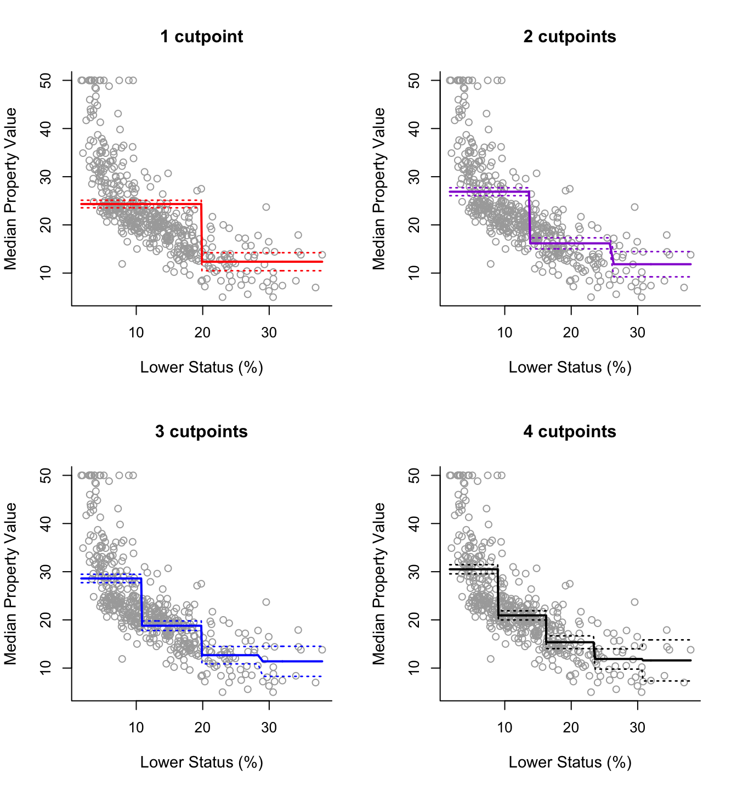

```{=html}
<style type="text/css">
  body{
  font-size: 12pt;
  line-height: 150%;
}
</style>
```
```{r setup, include=FALSE}
knitr::opts_chunk$set(echo = TRUE)
```

[Course Homepage](https://politicalscience.github.io/#machine1)

## Table of Contents {#contents}

-   [Polynomial Regressions](#polynomial)

-   [Step Functions](#step)

-   [Splines](#splines)

------------------------------------------------------------------------

Remember to load tidyverse.

```{r, message = FALSE}
library(tidyverse)
```

Let us also load the dataset we will be using for these examples (feel free to load your own dataset)

```{r, message = FALSE}
df <- read_csv("voctaxdata.csv")
```

------------------------------------------------------------------------

[Table of Contents](#contents){data-heading="Table of Contents"} \| [Course Homepage](https://politicalscience.github.io/#machine1)

# Polynomial Regressions {#polynomial}

[Intuition and Theory](#1001) \| [Example in R](#1002)

### Intuition and Theory {#1001}

In [Statistics II: Regression Analysis](https://politicalscience.github.io/#stats2), we covered standard linear regression, and how that can be used for prediction and statistical inference.

However, linear regression has a major weakness: its specific form allows little flexibility. The linear regression model must take the form:

$$
\hat{y}=\hat{\beta}_0 + \hat{\beta}_1 x_1 + ... + \hat{\beta}_p x_p
$$

where $\hat{\beta}_p$ is the slope (or constant rate of change) of $\hat{y}$ in regards to $x_p$. But, most actual real world relationships do not have a consistent rate of change as specified in the linear model.

-   In essence, the linear model simplifies the real-world relationship between two variables. Most real-world relationships between two variables are not exactly linear.

While the non-linearity of data isn't too important when we are concerned with causal inference, it is a major concern if our main goal is **prediction**. After all, if we want to make accurate predictions, we need models that fit the data well.

<br />

For example, let us take the following relationship between **export volume** and the **globalisation of the economy**. We can clearly see that this isn't a linear/straight line relationship.

```{r, echo = FALSE}
df %>%
  ggplot(aes(x = export, y = econglobal)) +
  geom_point() +
  geom_smooth(, color = "red")
```

<br />

Polynomial Regression is a way to adjust a linear regression to better fit the data we are trying to predict. Instead of using a straight linear line, we instead use polynomials. Examples of polynomial regression functions include:

$$
Quadratic: \hat{y} = \hat{\beta}_0 + \hat{\beta}_1 x + \hat{\beta}_2 x^2
$$

$$
Cubic: \hat{y} = \hat{\beta}_0 + \hat{\beta}_1 x + \hat{\beta}_2 x^2 + \hat{\beta}_2 x^2 + \hat{\beta}_3 x^3
$$

<br />

Or more generally, polynomials take the following form:

$$
\hat{y} = \hat{\beta}_0 + \hat{\beta}_1 x + \hat{\beta}_2 x^2 + ... + \hat{\beta}_d x^d
$$

<br />

The higher the degree $d$ of the polynomial, the more flexible we are allowing the relationship between $x$ and $y$ to be.

-   Basically, higher degree $d$ means more up and down curves in the polynomial.

<br />

If we recall moderating/interaction effect regressions in [Statistics II: Regression Analysis](https://politicalscience.github.io/#stats2), we will remember that an interaction effect is when two different $x$ variables are multiplied together in a regression.

$$
\hat{y} = \hat{\beta}_0 + \hat{\beta}_1 x_1 + \hat{\beta}_2 x_2 + \hat{\beta}_3 x_1 x_2
$$

<br />

Well, polynomials are moderating interaction effects between $x_1$ and itself: We can demonstrate this by rewriting the polynomial equation (lets take degree $d=2$ for simplicity).

$$
\hat{y} = \hat{\beta}_0 + \hat{\beta}_1 x_1 + \hat{\beta}_2 x_1^2
$$

Since $x_1^2 = x_1 * x_1$, we can rewrite the equation as:

$$
\hat{y}= \hat{\beta}_0 + \hat{\beta}_1 x_1 + \hat{\beta}_2 x_1 x_1
$$

Essentially, what this means is that the association between $x_1$ and $y$, depends on the value of $x_1$ where we evaluate the relationship. This introduces non-linearity into our model.

<br />

One downside of polynomial regression is that it is difficult to interpret our coefficients.

-   We can no longer hold other terms constant, since changing $x$ will also change the value of $x^2$

-   This makes interpretation of coefficients pretty much impossible.

However, we can interpret the significance: if $p < 0.05$ for a coefficient of $x^d$ where $d > 1$, then we can reject the null hypothesis of a linear relationship between $x$ and $y$, and conclude that there is a non-linear relationship between $x$ and $y$.

<br />

### Example in R {#1002}

We can run a polynomial regression with the functions **lm()** and **poly()**. The syntax is as follows:

```{r, eval = FALSE}

poly_reg <- lm(Y ~ poly(x, 3), data = df)

# use summary() function to print results
summary(poly_reg)
```

These are the parts of the syntax that can be altered:

-   **poly_reg** is the variable I am saving my regression model to. *You can name this anything you want to.*

-   **Y** is the Y variable (Dependent variable) you are trying to predict, and **X** is the X variables (independent variable) you are using to get your prediction. *Replace these with the variables you want to use.*

    -   NOTE: Always put the Y variable before the X variable. Separate the two with a tilda **\~**
    -   NOTE: You can add more simply by using a **+** sign and adding another variable.

-   **3** within the **poly()** function represents the degree (3 means $d=3$, or a cubic). *You can change this to anything you want to*.

    -   We will discuss how to choose the right polynomial in the next lesson about model selection.

-   **df** is the name of the data frame that I am drawing these X and Y variables from. *Replace this with the name of your data frame.*

We can visualise the line we just graphed with the following syntax:

```{r, eval = FALSE}
df %>%
  ggplot(aes(x = X_variable, y = Y_variable)) +
  geom_point() +
  geom_smooth(method = "lm", formula = y ~ poly(x, 2), color = "red")
```

These are the parts of the syntax that can be altered:

-   **df** is the name of the data frame that I am drawing these X and Y variables from. *Replace this with the name of your data frame.*

-   **X_variable** is the X variable, and **Y_variable** is the Y variable. *Replace these with the variables you want to use.*

<br />

Take the example of the relationship between **export volume** and the **globalisation of the economy**, which is the example I used earlier. I will test a quadratic form on the equation, as the graph above kind of looks like a quadratic relationship:

```{r}

poly_reg <- lm(econglobal ~ poly(export, 2), data = df)

# use summary() function to print results
summary(poly_reg)
```

We can see in the output there are 2 coefficients, one for **export** at degree 1, and one for **export** at degree 2.

-   Since **poly(export, 2)2** is significant with $p < 0.05$, we can reject the null hypothesis and conclude that there is indeed a non-linear relationship between **export** and **econglobal**.

We can visualise the line we just graphed:

```{r}
df %>%
  ggplot(aes(x = export, y = econglobal)) +
  geom_point() +
  geom_smooth(method = "lm", formula = y ~ poly(x, 2), color = "red")
```

We can see that this polynomial function follows the curve much better than a linear model would.

<br />

------------------------------------------------------------------------

[Table of Contents](#contents) \| [Course Homepage](https://politicalscience.github.io/#machine1)

# Step Functions {#step}

[Intuition and Theory](#2001) \| [Example in R](#contents)

### Intuition and Theory {#2001}

Step Functions, also known as piecewise-constant models, are models that use piecewise functions.

-   Piecewise functions are functions that are not continuous - they jump around.

Essentially, Step Function models are created as following:

1.  Divide $x$ into several small sections. For example, if $x$ is between $0$ and $10$, we can divide $x$ into 10 different segments: $x = [0,1), [1,2), ... [9, 10]$.
2.  Then, we find the average $y$ value within each segment of $x$
3.  Then, we graph the function as a constant - straight line of the average of $y$ within each segment.

<br />

The result is a bunch of horizontal straight lines, that jump at the boundaries between sections. The more sections we add in the domain of $x$, the more flexible our relationship will be. Take the following graphical example:



<br />

In more mathematical terms, a step function takes the following form:

$$
\hat{y} = \hat{\beta}_0 + \hat{\beta}_1 C_1(x) + \hat{\beta}_2 C_2(x) + ... + \hat{\beta}_d C_d(x)
$$

Where we transform $x$ into a set of dummy variables by defining a set of cutpoint thresholds $c_1, c_2, ..., c_d$ and function $C_d(x)$ is the following:

$$
C_0(x) = I(x < c_1)
$$

$$
C_1(x) = I(c_1 ≤ x < c_2)
$$

$$
C_2(x) = I(c_2 ≤ x < c_3)
$$

$$
C_d(x) = I(c_d ≤ x)
$$

Where $I(x)$ is an indicator function, so when the inequality condition within the function is satisfied, $I(x) = 1$, and when it is not satisfied, $I(x) = 0$

Where $\hat{\beta}_d$ is the average $y$ value within the corresponding $C_d$ section.

-   This is important when we interpret the coefficients of the model.

<br />

If we follow the above function, it basically means the following:

-   If the $x$ input value fits into one of the sections, that section's indicator function $I(x)$ will return 1, while all the other section's indicator functions $I(x)$ will return 0. Since $C(x) = I(x)$, $C_d(X)$ will return $1$ if $x$ is within the section, and will return $0$ if $x$ is not within the section.

-   That means all other section's coefficients will be cancelled out since $C(x)$ for other sections will equal $0$, meaning the only term remaining will be the section that specific $x$ value belongs to, since $C(x)$ for the correct section will equal $1$

-   Since all other sections are cancelled out, and the correct section has $C(x) = 1$, the output function will be $\hat{y} = \hat{\beta}_d * 1$. Since $\hat{\beta}_d$ is the mean $y$ value within that section, that is our estimate for the section.

<br />

The weakness of step functions is that since they are piecewise, they are not continuous. That means at the boundaries of sections, there will be massive jumps. This is quite unrealistic - normally, a small change in $x$ shouldn't drastically change $y$ like what occurs near the cutpoints of step functions.

<br />

### Example in R {#2002}

To implement step functions in R, we can use the **lm()** and **cut()** functions.

```{r, eval = FALSE}

step_model <- lm(Y ~ cut(X, 4), data = df)

# summary() to show results
summary(step_model)
```

These are the parts of the syntax that can be altered:

-   **step_model** is the variable I am saving my model to. *You can name this anything you want to.*

-   **Y** is the Y variable (Dependent variable) you are trying to predict, and **X** is the X variables (independent variable) you are using to get your prediction. *Replace these with the variables you want to use.*

    -   NOTE: Always put the Y variable before the X variable. Separate the two with a tilda **\~**
    -   NOTE: You can add more simply by using a **+** sign and adding another variable.

-   **3** within the **cut()** function represents the number of cut points. *You can change this to anything you want to*.

    -   We will discuss how to choose the right polynomial in the next lesson about model selection.

-   **df** is the name of the data frame that I am drawing these X and Y variables from. *Replace this with the name of your data frame.*

<br />

Take the example of the relationship between **export volume** and the **globalisation of the economy**. I will use 6 cut points for this model.

```{r}
step_model <- lm(econglobal ~ cut(export, 6), data = df)

# use summary() function to print results
summary(step_model)
```

You can see that the output creates different sections of $x$, and the estimate produced is the mean $y$ of the respective section.

<br />

------------------------------------------------------------------------

[Table of Contents](#contents) \| [Course Homepage](https://politicalscience.github.io/#machine1)

# Splines {#splines}

[Intuition and Theory](#3001) \| [Example in R](#3002)

### Intuition and Theory {#3001}

Splines are the combination of [Polynomial Models](#polynomial) and [Step Function Models](#step). It is important to understand how both work before we progress to Splines.

As we discussed previously, Step Function cuts $x$ into sections, and uses the mean of $y$ as the prediction for that section of $x$.

Splines take this a little further. Just like Step Functions, splines also cut $x$ into section. But instead of fitting a horizontal line at the mean of $y$, splines fit a polynomial model within every single section of $x$.

-   Essentially, instead of a piecewise function of horizontal lines, this is piecewise function of polynomials.

Just like Step Functions, the more cutpoints $c$ we make, the more flexible the function.

<br />

However, splines don't just fit a polynomial within each section of $x$. That would result in the same issue we saw in step functions: of giant changes in prediction at the border of sections.

Splines adjust for this issue by constraining the estimates so that there is:

1.  No discontinuity at the cut points
2.  The polynomials are smooth at the cut points.

This is done with a truncated basis function, but we will not get into this, and trust R to do the math for us.

<br />

The result is that Splines are very good at following very complex patterns in the data, since they have the advantages of both polynomials and step functions. Splines are thus very useful for prediction of non-linear relationships.

<br />

### Example in R {#3002}

To implement Splines in R, you will need to install and load the **splines** library.

```{r, message = FALSE}
library(splines)
```

We can implement splines in R with the **lm()** and **bs()** functions. The syntax is as follows:

```{r, eval = FALSE}
spline_model <- lm(Y ~ bs(X, df = 6, degree = 3), data = df)

#summary() to see output
summary(spline_model)
```

These are the parts of the syntax that can be altered:

-   **spline_model** is the variable I am saving my model to. *You can name this anything you want to.*

-   **Y** is the Y variable (Dependent variable) you are trying to predict, and **X** is the X variables (independent variable) you are using to get your prediction. *Replace these with the variables you want to use.*

    -   NOTE: Always put the Y variable before the X variable. Separate the two with a tilda **\~**
    -   NOTE: You can add more simply by using a **+** sign and adding another variable.

-   **df = 6** within the **bs()** function represents the number of cut points + 3. *You can change the number to anything you want to*.

    -   We will discuss how to choose the right polynomial in the next lesson about model selection.

-   **degree = 3** within the **bs()** function represents the degree of the polynomials you want to fit. *You can change the number to anything you want to*.

    -   The most common polynomial used is 3.

-   **df** is the name of the data frame that I am drawing these X and Y variables from. *Replace this with the name of your data frame.*

<br />

If we are interested in prediction, we can use the **predict()** function. You can predict in-sample data by setting **newdata** = the data frame you used for regression. You can predict out-of-sample data by using a dataframe with the same variables but new values. The syntax is as follows:

-   Note: this syntax for prediction works in general for any type of model, not just splines.

```{r, eval = FALSE}
#create new df for comparison of actual and prediction
df_results <- df %>%
  select(Y) #optional, may help with readability

# newdata is what values of X1, X2... to predict for.
df_results$prediction <- predict(spline_model, newdata = df)

# brief glimpse of the results
head(df_results)
```

These are the parts of the syntax that can be altered:

-   **df_results** is the results data frame I am creating. *You can name this anything you want to.*

-   **Y** is the Y variable I am trying to predict. *Replace this with the name of your Y variable.*

-   **spline_model** is the variable I am saving my prior model to. *Rename this to what your prior model was named.*

-   **df** is the name of the data frame that houses the $x$ values I want to predict for. *Replace this with the name of your data frame with the* $x$ *values you want to predict with.*

<br / >

Take the example of the relationship between **export volume** and the **globalisation of the economy**. I will use 5 cut points for this model and cubic polynomials, then predict the $y$ values.

```{r}
spline_model <- lm(econglobal ~ bs(export, df = 8, degree = 3), data = df)

summary(spline_model)

```

Most of the above is hard to interpret. The coefficients are practically useless for us. However, we can use the Residual Standard Error and Multiple R-squared as normal.

Now let's generate predictions:

```{r}
#create new df for comparison of actual and prediction
df_results <- df %>%
  select(econglobal) #optional, may help with readability

# newdata is what values of X1, X2... to predict for.
df_results$prediction <- predict(spline_model, newdata = df)

# brief glimpse of the results
head(df_results)
```

With the dataframe above, you can compare the actual values in the dataset with the predictive values generated.

<br />

------------------------------------------------------------------------

[Table of Contents](#contents) \| [Course Homepage](https://politicalscience.github.io/#machine1)
