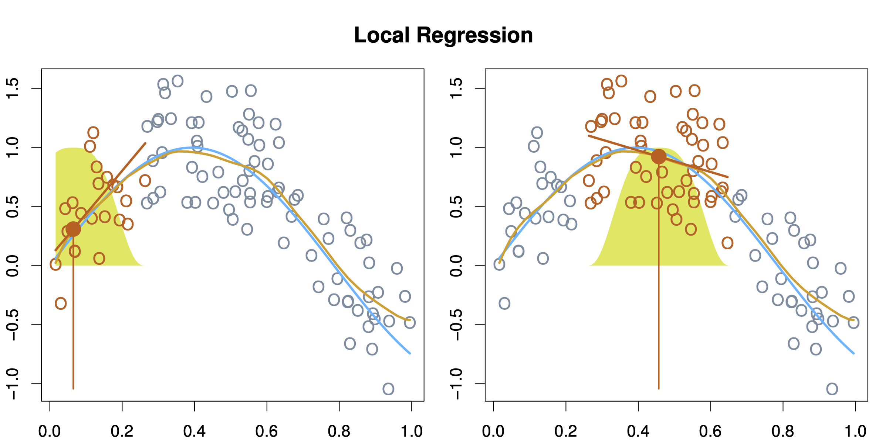

```{=html}
<style type="text/css">
  body{
  font-size: 12pt;
  line-height: 150%;
}
</style>
```
```{r setup, include=FALSE}
knitr::opts_chunk$set(echo = TRUE)
```

[Course Homepage](https://politicalscience.github.io/#machine1)

## Table of Contents {#contents}

-   [Local Linear Regressions](#local)

-   [Generalised Additive Models (GAMs)](#gam)

------------------------------------------------------------------------

Remember to load tidyverse.

```{r, message = FALSE}
library(tidyverse)
```

Let us also load the dataset we will be using for these examples (feel free to load your own dataset)

```{r, message = FALSE}
df <- read_csv("voctaxdata.csv")
```

------------------------------------------------------------------------

[Table of Contents](#contents){data-heading="Table of Contents"} \| [Course Homepage](https://politicalscience.github.io/#machine1)

# Local Linear Regressions {#local}

[Intuition and Theory](#1001) \| [Example in R](#1002)

### Intuition and Theory {#1001}

Local regression models don't use some transformation function $f$ to change the linear model (unlike polynomial models - see [Non-Linear Methods I](https://politicalscience.github.io/machine_learning_1/nonlinear.html)).

Instead, Local Linear Regression estimates the relationship between $x$ and $y$, at different points in the range of $x$.

-   Let us define a specific point in the range of $x$ as $x_0$

-   For each specific point $x_0$, we fit a linear regression model, but only with points within some short distance on either side of $x_0$.

-   This fitted local regression isn't a normal regression: instead, we weight points closer to $x_0$, meaning points closer to $x_0$ will have a bigger effect on the local regression slope than points further away from $x_0$

-   To determine how many points around $x_0$ to include in the local regression, we introduce the parameter span, $s$

-   When the span $s$ is larger, that means more values around $x_0$ are considered, meaning a less "flexible" model that doesn't fit the local alterations as close, but fits the broad patter better. When the span $s$ is smaller, that means less values around $x_0$ are considered, meaning a more "flexible" model that fits the data closer, but sometimes overfits the data.

-   With each point $x_0$ getting its own local regression, we can then stitch together these local regressions to get a prediction function.

<br />

Below is a figure showcasing how local regression works. At some specific point of $x$, $x_0$, showed by the vertical red line, we consider the surrounding points (showed with their weights in yellow), and produce a local linear regression. We then stitch these local regressions together to get a prediction function.



<br />

Local linear regressions are considered excellent for fitting smooth functions without too many dimensions (ex. less than 4 independent variables). However, as the number of dimensions increase, it becomes less effective of a prediction method.

<br />

### Example in R {#1002}

We can run a local linear regression with the functions **loess()**. The syntax is as follows:

```{r, eval = FALSE}
loess_model <- loess(Y ~ X1 + X2, data = df, span = 0.5)

#summary() for output
summary(loess_model)
```

These are the parts of the syntax that can be altered:

-   **loess_model** is the variable I am saving my model to. *You can name this anything you want to.*

-   **Y** is the Y variable (Dependent variable) you are trying to predict, and **X1 + X2** are the X variables (independent variable) you are using to get your prediction. *Replace these with the variables you want to use.*

    -   NOTE: Always put the Y variable before the X variable. Separate the two with a tilda **\~**
    -   NOTE: You can add more simply by using a **+** sign and adding another variable.

-   **Span = 0.5** function represents the span $s$. *You can change this to anything you want to*.

    -   We will discuss how to choose the right polynomial in the next lesson about model selection.

-   **df** is the name of the data frame that I am drawing these X and Y variables from. *Replace this with the name of your data frame.*

<br />

We can visualise the line we just graphed with the following syntax:

```{r, eval = FALSE}
df %>%
  ggplot(aes(x = X_variable, y = Y_variable)) +
  geom_point() +
  geom_smooth(method = "loess", color = "red")
```

These are the parts of the syntax that can be altered:

-   **df** is the name of the data frame that I am drawing these X and Y variables from. *Replace this with the name of your data frame.*

-   **X_variable** is the X variable, and **Y_variable** is the Y variable. *Replace these with the variables you want to use.*

<br />

If we are interested in prediction, we can use the **predict()** function. You can predict in-sample data by setting **newdata** = the data frame you used for regression. You can predict out-of-sample data by using a dataframe with the same variables but new values. The syntax is as follows:

-   Note: this syntax for prediction works in general for any type of model, not just local regressions.

```{r, eval = FALSE}
#create new df for comparison of actual and prediction
df_results <- df %>%
  select(Y) #optional, may help with readability

# newdata is what values of X1, X2... to predict for.
df_results$prediction <- predict(loess_model, newdata = df)

# brief glimpse of the results
head(df_results)
```

These are the parts of the syntax that can be altered:

-   **df_results** is the results data frame I am creating. *You can name this anything you want to.*

-   **Y** is the Y variable I am trying to predict. *Replace this with the name of your Y variable.*

-   **loess_model** is the variable I am saving my linear regression model to. *You can name this anything you want to.*

-   **df** is the name of the data frame that houses the $x$ values I want to predict for. *Replace this with the name of your data frame with the* $x$ *values you want to predict for.*

<br />

Take the example of the relationship between **export volume** and the **globalisation of the economy:**

```{r}
loess_model <- loess(econglobal ~ export, data = df, span = 0.5)

summary(loess_model)
```

The default output doesn't tell us much information, but we can use the Residual Standard Error to measure performance in-sample.

Let us graph the relationship as follows:

```{r}
df %>%
  ggplot(aes(x = export, y = econglobal)) +
  geom_point() +
  geom_smooth(method = "loess", color = "red")
```

Let us generate prediction values for our in-sample, and compare them to the real $y$ values:

```{r}
#create new df for comparison of actual and prediction
df_results <- df %>%
  select(econglobal) #optional, may help with readability

# newdata is what values of X1, X2... to predict for.
df_results$prediction <- predict(loess_model, newdata = df)

# brief glimpse of the results
head(df_results)
```

<br />

------------------------------------------------------------------------

[Table of Contents](#contents) \| [Course Homepage](https://politicalscience.github.io/#machine1)

# Generalised Additive Models (GAMs) {#gam}

[Intuition and Theory](#2001) \| [Example in R](#2002)

### Intuition and Theory {#2001}

To understand Generalised Additive Models, we must understand [Local Linear Regression](#local) from earlier in this lesson, as well as Polynomial Regression, Step Functions, and Splines covered in [Non-Linear Methods I](https://politicalscience.github.io/machine_learning_1/nonlinear.html).

<br />

One of the best aspects of standard linear regression is that we can include many predictors that are added together.

-   Remember the form of linear regression: $\hat{y}=\hat{\beta}_0 + \hat{\beta}_1 x_1 + ... + \hat{\beta}_p x_p$

Generalised additive models build on this: not just by allowing us to include many independent variables, but also, allowing us to apply different methods to each independent variable:

$\hat{y} = \beta_0 + f_1(x_1) + f_2(x_2) + ... + f_p(x_p)$

-   Where $f_1, f_2, ..., f_p$ can all be different types of transformation methods, such as splines, local regressions, step functions, and polynomials.

-   This allows us to mix different methods, based on our beliefs about the relationship between $x_p$ and $y$

<br />

We can also add interaction/moderating effects just like in standard linear regression.

This flexibility of GAMs makes it a favourite method for many when trying to make accurate predictions.

<br />

### Example in R {#2002}

First, we will need the package **gam** and **splines** to implement these methods in R:

```{r, message = FALSE}

library(splines)
library(gam)
```

<br />

We can implement the different methods we have learned into gam with certain functions:

-   Splines: **bs(variable, df = #, degree = \#)**

-   Local Regression: **lo(variable, \#)**

-   Step Functions: **cut(variable, \#)**

-   Polynomials: **poly(variable, \#)**

For more information on syntax, check out the Local Regression section earlier in this lesson, and the Splines, Step Functions, and Polynomials section in [Non-Linear Methods I](https://politicalscience.github.io/machine_learning_1/nonlinear.html).

<br />

We can include all of these in a GAM with the **gam()** function. We will need the package **gam** for this. The syntax is as follows:

```{r, eval = FALSE}

gam_model <- gam(Y ~ bs(X1, 5) + lo(X2, 0.5), cut(X3, 6), poly(X4, 3) + X5, data = df)

```

These are the parts of the syntax that can be altered:

-   **gam_model** is the variable I am saving my model to. *You can name this anything you want to.*

-   **Y** is the Y variable (Dependent variable) you are trying to predict, and **X1, X2, X3, X4, X5** are the X variables (independent variable) you are using to get your prediction. *Replace these with the variables you want to use.*

    -   NOTE: Always put the Y variable before the X variable. Separate the two with a tilda **\~**
    -   NOTE: You can add more simply by using a **+** sign and adding another variable.

-   **bs(), lo(), cut(), poly()** are all different non-linear methods. *You can pick and chose which methods to put on what variables - you don't need to include all, you can use one method on multiple variables.*

-   **df** is the name of the data frame that I am drawing these X and Y variables from. *Replace this with the name of your data frame.*

<br />

If we are interested in prediction, we can use the **predict()** function. You can predict in-sample data by setting **newdata** = the data frame you used for regression. You can predict out-of-sample data by using a dataframe with the same variables but new values. The syntax is as follows:

-   Note: this syntax for prediction works in general for any type of model, not just GAMs.

```{r, eval = FALSE}
#create new df for comparison of actual and prediction
df_results <- df %>%
  select(Y) #optional, may help with readability

# newdata is what values of X1, X2... to predict for.
df_results$prediction <- predict(gam_model, newdata = df)

# brief glimpse of the results
head(df_results)
```

These are the parts of the syntax that can be altered:

-   **df_results** is the results data frame I am creating. *You can name this anything you want to.*

-   **Y** is the Y variable I am trying to predict. *Replace this with the name of your Y variable.*

-   **gam_model** is the variable I am saving my linear regression model to. *You can name this anything you want to.*

-   **df** is the name of the data frame that houses the $x$ values I want to predict for. *Replace this with the name of your data frame with the* $x$ *values you want to predict for.*

<br />

Take this following example (Note, I just chose the methods to apply to the variables at random):

```{r, echo = FALSE}
options(warn = -1)
```

```{r, message = FALSE}

gam_model <- gam(econglobal ~ lo(export, 0.5) + bs(gini, df = 9, degree = 3), data = df)
```

```{r}
summary(gam_model)
```

```{r, echo = FALSE}
options(warn = 0)
```

We can use our model to make some in-sample predictions:

```{r}
#create new df for comparison of actual and prediction
df_results <- df %>%
  select(econglobal) #optional, may help with readability

# newdata is what values of X1, X2... to predict for.
df_results$prediction <- predict(gam_model, newdata = df)

# brief glimpse of the results
head(df_results)
```

<br />

------------------------------------------------------------------------

[Table of Contents](#contents) \| [Course Homepage](https://politicalscience.github.io/#machine1)
